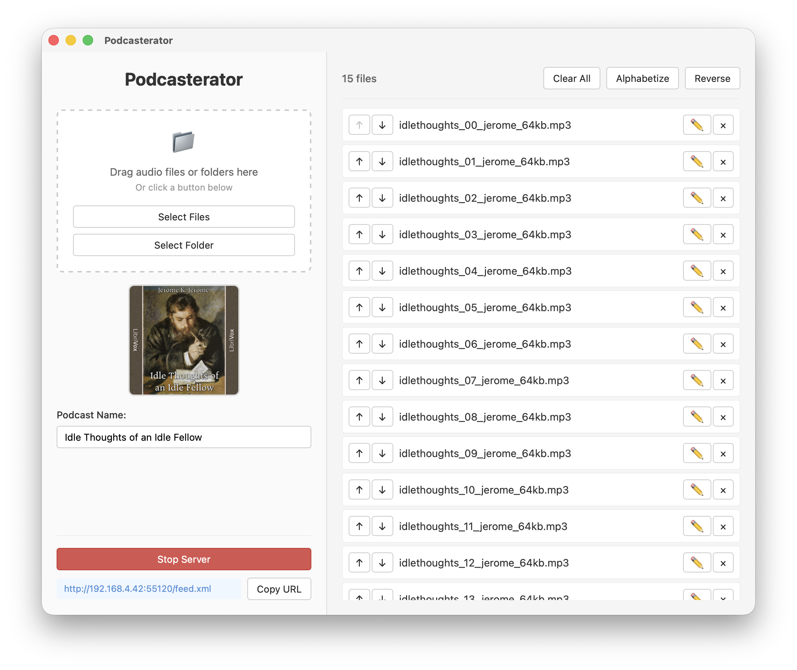

# Podcasterator

A cross-platform desktop app that creates a local podcast server from your audio files. Turn any MP3, M4A, MP4, or M4B files into a podcast feed you can subscribe to in a podcast app.

## Building

- **macOS/Linux**: `./build.sh`
- **Windows**: `build.bat`

With no flags, both scripts build a raw binary only. Output from `--makebundle` and `--makepackage` is copied to the `releases/` directory.

- `--makebundle` — Portable distributable (.app on macOS, AppImage on Linux; same as plain build on Windows)
- `--makepackage` — System installer (DMG on macOS, NSIS + MSI on Windows, distro package on Linux)
- `--check` — Check build dependencies without building
- `--clean` — Remove all build artifacts

## File Locations

### Temporary Files (Audio & Artwork)

Files are copied here when added to the app:

- **macOS**: `~/Library/Caches/podcasterator/`
- **Linux**: `~/.cache/podcasterator/` (follows XDG Base Directory spec)
- **Windows**: `%LOCALAPPDATA%\podcasterator\`

They are deleted when cleared from the interface or when the app quits. The artwork and podcast name persist between launches unless manually cleared. 

### Configuration File Location 

- **macOS**: `~/Library/Application Support/Podcasterator/state.json`
- **Linux**: `~/.config/Podcasterator/state.json` 
- **Windows**: `%APPDATA%\Podcasterator\state.json`

## Supported Formats

**Audio**: MP3, M4A, MP4, M4B (MP4/M4B auto-renamed to M4A)
**Images**: PNG, JPG, JPEG, GIF, BMP, TIFF

## How It Works

1. Audio files are copied to a temp directory with unique IDs
2. RSS feed is generated with enclosures pointing to local files, in the order shown in the app
3. HTTP server serves the feed and audio files on a free port on your local network
4. Your podcast app downloads episodes like any other podcast
5. Once podcast episodes are downloaded by your app, you can stop the server

## License

Released under the MIT license.
